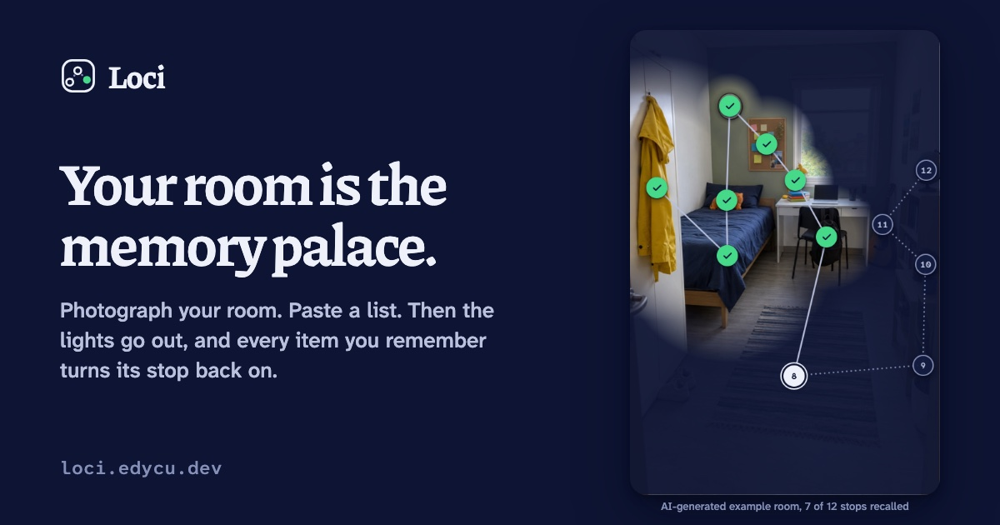

<div align="center">


# Loci

**Your room is the memory palace.**

Photograph your room, paste a list, and learn it along one route through real objects.<br />
Then the lights go out, and every item you remember turns its stop back on.

[**Open Loci**](https://loci.edycu.dev) ([mirror](https://devpost-learn-loci.vercel.app)) · [Scope](devpost/scope.md) · [PRD](devpost/prd.md) · [Spec](devpost/spec.md) · [Build log](devpost/checklist.md)



</div>

## What it does

Loci is the method of loci (the "memory palace") with your own room as the palace.

1. **Pick a room and a list.** Take or choose a photo of your room, or borrow one of three example rooms. Paste 3 to 12 items, in order, 4 words or fewer each.
2. **Build.** An AI finds the most memorable objects in the photo. Plain code picks the stops and joins them into one route, from the leftmost stop to the rightmost. Item 1 sits on stop 1, item 2 on stop 2, and so on. A second AI call writes a short, strange scene for each stop, with a sound-alike for hard words ("trochlear" → "truck-lear").
3. **Learn.** The view walks the route, zooming toward each object, with its scene.
4. **Recall, lights out.** The photo goes dark. At each stop you say or type the item. A right answer turns the pin green and lights that part of the room again. A wrong one stays dark.
5. **Result.** How many you got on the first try, how long you learned and how long you recalled. Retry only the misses. When every pin is green, the whole room is back.

Palaces stay on your device and are still there tomorrow.

## Try it

- **One tap:** on the home screen, **Try it: 12 cranial nerves** opens a palace prepared in advance in an AI-generated student room. No photo or AI call needed.
- **Your own room:** choose a photo, paste a list, **Build my palace**. Building usually takes 10–30 seconds (finding objects, then writing scenes).
- **Voice:** in Chrome or Edge, tap **Say it instead** once during recall and say the list. Other browsers type.

## How it works

| Step | Where | What decides |
|---|---|---|
| Shrink the photo to 1280 px on the device | `src/lib/image.ts` | code |
| Find objects (labels + boxes) | `api/anchors.ts` → Gemini (`gemini-3.8-flash`, then `gemini-3.5-flash`, then `gemini-3.1-flash-lite`), DeepSeek last | AI proposes |
| Keep distinct, uncrowded objects; shortest route from the leftmost to the rightmost stop | `shared/route.ts` (exact search over up to 12 stops) | code |
| Write one scene per stop from object names only, never the photo | `api/scenes.ts` → DeepSeek, Gemini as fallback | AI proposes |
| Check each answer | `shared/score.ts` | code, never AI |
| Read spoken answers | browser speech-to-text + `shared/voice.ts` | code |
| Save palaces and results | IndexedDB in the browser (`src/lib/store.ts`) | code |

**The answer checker** (`shared/score.ts`) lowercases both texts, removes accents, punctuation and leading numbering ("1."), then counts typing changes per word. Words of 4 letters or fewer must be exact, 5–9 letters allow 1 change, 10 or more allow 2, with at most 3 in the whole answer. So "occulomotor" counts for "Oculomotor", but "Vitamin D" never counts for "Vitamin C". You can add other accepted answers after " / " in your list (`Sodium / Na`).

**Voice** uses the same checker on each of the browser's guesses, plus a sound-alike key ("truck lear" = "trochlear"). You can say two items in one breath, say "skip" or "pass", or jump ahead. A phrase that matches nothing in your list counts as "didn't catch that" and costs nothing. What the browser heard is always shown.

## Privacy

Your photo is sent once to an AI (Google Gemini, or DeepSeek if Gemini is busy) to find objects. The server does not store it. Writing scenes uses only object names and your list. Your palaces and results stay in your own browser. Leave people and private papers out of the photo.

## Run it locally

Needs Node 22 or newer.

```sh
npm install
cp .env.example .env.local   # add GEMINI_API_KEY and/or DEEPSEEK_API_KEY
npm run dev                  # http://localhost:5174 (also serves /api/anchors and /api/scenes)
```

`npm run examples` rebuilds the prepared example palaces from the real helpers (dev server running).

## Tests

- `npm test`: 76 unit tests (Vitest) for the list parser, route, answer checker, voice interpreter, recall walk, model-answer checks, storage, colour contrast and the prepared examples.
- `npm run e2e`: 16 browser checks (Playwright) against the production build, with the AI helpers and the microphone stubbed, so no keys are needed. They cover typed and spoken recall, retries, saved palaces, examples, failure states and reduced motion.
- `LIVE=1 BASE_URL=http://localhost:5174 npx playwright test`: 7 checks that use the real AI (also run against the live site): your own photo, learning, and two hands-on passes (typos, a skip, a retry, keyboard only, odd inputs, a reload, delete).
- `npm run build`: type-check and production build.

## Built with the Devpost Learn skill pack

The project was planned and built with the [Devpost Learn skill pack](https://github.com/challengepost/learn-ai-basics) (`1-start` to `5-build`). The planning documents are in [`devpost/`](devpost): [scope](devpost/scope.md), [PRD](devpost/prd.md), [technical spec](devpost/spec.md), and the [build checklist](devpost/checklist.md) with every step, check and revision. The learner asked the agent to answer the skills' interview questions from their own planning notes; those answers are marked in each document.

## Stack

Vite 8, React 19, TypeScript 7 · two Vercel functions using plain `fetch` (no AI SDK) · idb-keyval · Web Speech API · Vitest 5 · Playwright 1.63.

## Credits

- The three example rooms are AI-generated images (labelled in the app). Their generation prompts are embedded in the files.
- Fonts: [Piazzolla](https://fonts.google.com/specimen/Piazzolla), [Atkinson Hyperlegible Next](https://fonts.google.com/specimen/Atkinson+Hyperlegible+Next) and [Atkinson Hyperlegible Mono](https://fonts.google.com/specimen/Atkinson+Hyperlegible+Mono) (SIL Open Font License). Icons: [Lucide](https://lucide.dev) (ISC).

## License

[MIT](LICENSE)
