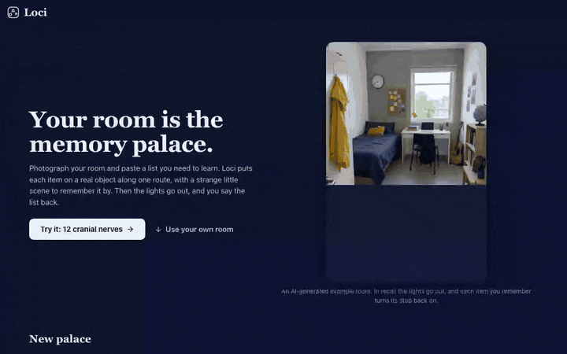
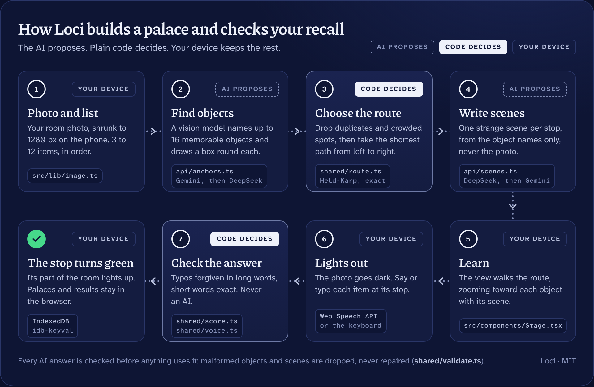

<div align="center">


<h1>Loci 📸</h1>

<p><b>Your room is the memory palace.</b></p>

<p>Photograph your room, paste a list, and learn it along one route through real objects.<br />
Then the lights go out, and every item you remember turns its stop back on.</p>



<br /><br />

[](https://loci.edycu.dev)
[](https://loci.edycu.dev/judge/)
[](https://loci.edycu.dev/story/)
[](https://loci.edycu.dev/deck/)
[](https://learn-ai-basics.devpost.com/)

<br />

[](https://github.com/edycutjong/loci/actions/workflows/ci.yml)
[](https://github.com/edycutjong/loci/actions/workflows/gitleaks.yml)
[](https://github.com/edycutjong/loci/releases/latest)
[](LICENSE)
<br />


</div>

---

## 📸 See it in Action

<div align="center">
  
</div>

<sub>The real app, recorded from the production build by <code>scripts/record-demo.mjs</code>: the one-tap example palace, four stops of Learn, then lights out and twelve answers until every stop is green. The answers are typed by the script, not recalled by a person.</sub>

> **Try it in 30 seconds.** Open [Loci](https://loci.edycu.dev) → **Try it: 12 cranial nerves** → **Next stop** a few times → **Lights out** → type what you remember. The [judge page](https://loci.edycu.dev/judge/) walks you through it, with the answers.

- **One tap:** on the home screen, **Try it: 12 cranial nerves** opens a palace prepared in advance in an AI-generated student room. No photo or AI call needed.
- **Your own room:** choose a photo, paste a list, **Build my palace**. Building usually takes 10–30 seconds (finding objects, then writing scenes).
- **Voice:** in Chrome or Edge, tap **Say it instead** once during recall and say the list. Other browsers type.

If `loci.edycu.dev` doesn't open yet, the same app is at [loci.edycu.dev](https://loci.edycu.dev).

## 💡 The Problem & Solution

### The Problem

Students have to learn ordered lists for exams: the 12 cranial nerves, the first 12 elements, the steps of a procedure. Most use flashcards, re-reading and first-letter sentences ("Oh Oh Oh To Touch And Feel…"), which hold the first letters but not the words. The memory palace works, but building one by hand takes a long time, so most people never try it.

### The Solution

Loci is the method of loci (the "memory palace") with your own room as the palace.

1. **Pick a room and a list.** Take or choose a photo of your room, or borrow one of three example rooms. Paste 3 to 12 items, in order, 4 words or fewer each.
2. **Build.** An AI finds the most memorable objects in the photo. Plain code picks the stops and joins them into one route, from the leftmost stop to the rightmost. Item 1 sits on stop 1, item 2 on stop 2, and so on. A second AI call writes a short, strange scene for each stop, with a sound-alike for hard words ("trochlear" → "truck-lear").
3. **Learn.** The view walks the route, zooming toward each object, with its scene.
4. **Recall, lights out.** The photo goes dark. At each stop you say or type the item. A right answer turns the pin green and lights that part of the room again. A wrong one stays dark.
5. **Result.** How many you got on the first try, how long you learned and how long you recalled. Retry only the misses. When every pin is green, the whole room is back.

Palaces stay on your device and are still there tomorrow.

## 🏗️ Architecture & Tech Stack

<details>
<summary><b>How it works</b>: the AI proposes, plain code decides, your device keeps the rest</summary>

<br />



| Step | Where | What decides |
|---|---|---|
| Shrink the photo to 1280 px on the device | `src/lib/image.ts` | code |
| Find objects (labels + boxes) | `api/anchors.ts` → Gemini (`gemini-3.8-flash`, then `gemini-3.5-flash`, then `gemini-3.1-flash-lite`), DeepSeek last | AI proposes |
| Keep distinct, uncrowded objects; shortest route from the leftmost to the rightmost stop | `shared/route.ts` (exact search over up to 12 stops) | code |
| Write one scene per stop from object names only, never the photo | `api/scenes.ts` → DeepSeek, Gemini as fallback | AI proposes |
| Check each answer | `shared/score.ts` | code, never AI |
| Read spoken answers | browser speech-to-text + `shared/voice.ts` | code |
| Save palaces and results | IndexedDB in the browser (`src/lib/store.ts`) | code |

**The answer checker** (`shared/score.ts`) lowercases both texts, removes accents, punctuation and leading numbering ("1."), then counts typing changes per word. Words of 4 letters or fewer must be exact, 5–9 letters allow 1 change, 10 or more allow 2, with at most 3 in the whole answer. So "occulomotor" counts for "Oculomotor", but "Vitamin D" never counts for "Vitamin C". You can add other accepted answers after " / " in your list (`Sodium / Na`).

**Voice** uses the same checker on each of the browser's guesses, plus a sound-alike key ("truck lear" = "trochlear"). You can say two items in one breath, say "skip" or "pass", or jump ahead. A phrase that matches nothing in your list counts as "didn't catch that" and costs nothing. What the browser heard is always shown.

**Every AI answer is checked before anything uses it** (`shared/validate.ts`): malformed boxes and empty scenes are dropped, never repaired, and the server helpers report which model answered, which ones they passed over and why, and the tokens each used.

</details>

| Layer | Technology |
|---|---|
| App | Vite 8, React 19, TypeScript 7 (strict); self-hosted Piazzolla and Atkinson Hyperlegible fonts; Lucide icons |
| Server | Two Vercel Functions, `api/anchors.ts` and `api/scenes.ts`, using plain `fetch` (no AI SDK) |
| AI | Objects: `gemini-3.8-flash` → `gemini-3.5-flash` → `gemini-3.1-flash-lite` → `deepseek-flash`. Scenes: `deepseek-flash` → Gemini |
| Decisions | Plain TypeScript in `shared/`: list parser, route, answer checker, voice interpreter, validation |
| On the device | IndexedDB through idb-keyval; Web Speech API for voice |
| Tests | Vitest 5, fast-check, Playwright 1.63 |

**Privacy.** Your photo is sent once to an AI (Google Gemini, or DeepSeek if Gemini is busy) to find objects. The server does not store it. Writing scenes uses only object names and your list. Your palaces and results stay in your own browser. Leave people and private papers out of the photo.

## 🏆 Devpost Learn Skill Pack Integration

The project was planned and built with the [Devpost Learn skill pack](https://github.com/challengepost/learn-ai-basics), `1-start` to `5-build`. The planning documents are in [`devpost/`](devpost):

| Document | What it holds |
|---|---|
| [`scope.md`](devpost/scope.md) | the idea cut down to a proof of concept: who it's for, the core loop, what "working" looks like |
| [`prd.md`](devpost/prd.md) | every screen, behaviour, state and edge case |
| [`spec.md`](devpost/spec.md) | the technical blueprint: stack, components, the answer checker's rules, failure modes |
| [`checklist.md`](devpost/checklist.md) | the build log: eight slices, each verified and committed, the hands-on checks and every revision |
| [`app-map.html`](devpost/app-map.html) | a map of the finished code, from a typed answer to a green pin |

The learner asked the agent to answer the skills' interview questions from their own planning notes; those answers are marked in each document.

## 📊 Engineering Rigor

A real run on the live site with nothing stubbed, and the checks that run on every push. Full record: [DEMO.md](DEMO.md) · one page for judges: [JUDGE.md](JUDGE.md).

| What | Result | Proof |
|---|---|---|
| Palaces built on the live site from 3 AI-generated rooms × 3 lists | **9 / 9** | [`receipt-2026-10-04.json`](public/judge/receipt-2026-10-04.json) |
| Stops placed by code, on the objects the AI found | **102** on 142 | [DEMO.md](DEMO.md) |
| Scenes that spell their item exactly | **102 / 102** | [DEMO.md](DEMO.md) |
| Wait from "Build my palace" to the first scene | median **14.45 s**, slowest 30.02 s | [DEMO.md](DEMO.md) |
| Cost of all nine palaces | **$0.1151** at list prices, **$0.0115** billed | [DEMO.md](DEMO.md#tokens-and-cost) |
| Unit tests | **99** | [`tests/`](tests) |
| Generated answers on the checker, per run | **60,000** | [`tests/score.property.test.ts`](tests/score.property.test.ts) |
| Browser checks, AI and microphone stubbed | **29** | [`e2e/`](e2e) |
| Live checks with the real AI | **7** | [`e2e/live/`](e2e/live) |

### Regression tests named after their bugs (11)

Each one pins a real defect found while planning and building ([build log](devpost/checklist.md)):

1. One typo allowance for the whole answer let "Vitamin D" pass for "Vitamin C"; typos now count per word. `tests/regressions.test.ts`
2. The first sound key split "hippo glossal" from "hypoglossal" and nearly joined Hydrogen and Nitrogen. `tests/regressions.test.ts`
3. With only a rule, DeepSeek dropped the item's exact spelling in 8 of 12 sound-alike scenes; the prompt now shows a worked example. `tests/regressions.test.ts`
4. A scenes call ran out of its time budget; a model that times out now hands over to the next one inside the same budget. `tests/regressions.test.ts`
5. The disabled Build button's label measured about 1.3:1 at 45% opacity; disabled controls use readable colours, never opacity. `tests/regressions.test.ts`
6. The Recall tab did nothing on the result screen; every way back into the dark now starts a fresh walk. `e2e/regressions.spec.ts`
7. A thin lit sliver showed at the photo's edge in recall on phones; the night now overhangs the photo. `e2e/regressions.spec.ts`
8. The zoomed room looked soft because `will-change` kept the photo painted small; the camera never sets it. `e2e/regressions.spec.ts`
9. The result appeared a few milliseconds before the finished walk was stored, so a reload or a closed tab right away could lose the score; the result now appears only once the walk is saved. Found by an independent audit of this repository. `e2e/regressions.spec.ts`
10. With the list as phrase hints, Chrome's on-device speech recognition echoed them in its in-progress guesses ("Permian Triassic Permian Cambrian Cambrian…"), and the app showed them under "Hearing"; with hints on, only its final answers are shown. Found while recording the demo video. `tests/regressions.test.ts`
11. The same echo reached its final answers about once in a hundred words: "Cambrian Jurassic Quaternary" for Quaternary got "didn't catch that", and "Cretaceous Cretaceous Cretaceous" was shown as heard. Leading words that name stops already answered are now skipped, and a heard word shows once. `tests/regressions.test.ts`

### Checked, not promised

- **No wrong answer turns a stop green.** Six properties over 60,000 generated answers per run: right answers typed sloppily (case, accents, spacing, punctuation, numbering, one typo in a long word) always count; a short word one letter off, one change too many, more than 3 changes, or an answer with no letters never count. Each case is built so its verdict is known without asking the checker.
- **Keys never reach the browser.** `tests/keys.test.ts` builds the client with canary keys set and fails if any emitted file holds a key, a provider's address or a key header. `e2e/judge.spec.ts` follows the 30-second path and fails if the browser sends any request off the site.
- **A score you've seen is a score that's saved.** The result appears only after the walk is written to IndexedDB. `e2e/regressions.spec.ts` records both moments inside the page and fails if the order ever flips, then reloads to find the score still there.
- **The judge's path works.** `e2e/judge.spec.ts` opens `/judge/` with no cookies or saved state, checks its numbers against the receipt, and follows its 30-second path through the app.

### Honest limits (5)

1. **Recall in one sitting, nothing more.** Loci shows a first-try score, learning time and recall time. It makes no claim about next week and has no spaced repetition.
2. **The receipt's rooms are AI-generated.** Real rooms are messier. When free-tier Gemini quotas run out, objects come from `gemini-3.1-flash-lite`, which draws looser boxes.
3. **Voice is Chrome and Edge only.** It uses the browser's own speech recognition. Automated Chrome can't open a microphone, so voice is tested with a stand-in recognizer; typing works everywhere.
4. **Your photo goes to an AI once.** A free-tier Gemini key lets Google use what it receives, so leave people and papers out.
5. **The two server helpers have no rate limit.** Heavy use by one person would spend the AI budget; a proof of concept for a handful of testers doesn't need one yet.

## 🚀 Getting Started

### Prerequisites

- Node 22 or newer, and npm
- Optional: a Gemini and/or DeepSeek API key, only for building palaces from new photos on your own machine

### Installation

```sh
npm ci
cp .env.example .env.local   # add GEMINI_API_KEY and/or DEEPSEEK_API_KEY
npm run dev                  # http://localhost:5174 (also serves /api/anchors, /api/scenes, /story/, /deck/ and /judge/)
```

`npm run examples` rebuilds the prepared example palaces from the real helpers (dev server running). `npm run demo` records the demo clip of the real app with Playwright and converts it with ffmpeg (preview server running).

## 🧪 Testing & CI

```sh
npm run typecheck   # tsc -b, strict
npm test            # 99 unit tests, including 60,000 generated answers and the no-key build check
npm run e2e         # 29 browser checks on the production build, AI helpers and microphone stubbed
npm run receipt     # the real run: 9 palaces on the live site, nothing stubbed (needs no key)
LIVE=1 BASE_URL=http://localhost:5174 npx playwright test   # 7 checks with the real AI
```

| Workflow | What it runs | When |
|---|---|---|
| [CI](.github/workflows/ci.yml) | `npm ci` → typecheck → unit tests → production build on Node 22 and 24, then the browser checks on `vite preview` with the AI stubbed | every push and pull request |
| [gitleaks](.github/workflows/gitleaks.yml) | a secret scan of the whole git history with a pinned, checksum-verified gitleaks | every push and pull request, and weekly |
| [Dependabot](.github/dependabot.yml) | npm and GitHub Actions updates, grouped, no major versions | monthly |

The tests are a separate, deterministic replay: they stub the AI so they need no key, and they never stand in for the product. The product's own numbers come from `npm run receipt` against the live site ([DEMO.md](DEMO.md)).

## 📁 Project Structure

```
api/          the two Vercel Functions: anchors.ts (find objects), scenes.ts (write scenes)
shared/       code that decides: route, answer checker, voice interpreter, list parser, validation, model ladder
src/          the React app: screens, the stage, recall and result panels, on-device storage
public/       example rooms, fonts, media, and the story, deck, judge and 404 pages
tests/        unit, regression, property and no-key tests (Vitest)
e2e/          browser checks (Playwright); e2e/live/ uses the real AI
scripts/      receipt.mjs (the real run), prebuild-examples.mjs, record-demo.mjs
devpost/      the skill pack's planning documents and build log
DEMO.md       the real run, with receipts
JUDGE.md      one page for judges
```

## 📽️ Demo Materials

- **App:** [loci.edycu.dev](https://loci.edycu.dev)
- **For judges:** [/judge/](https://loci.edycu.dev/judge/) and [JUDGE.md](JUDGE.md)
- **Story page and pitch deck:** [/story/](https://loci.edycu.dev/story/) · [/deck/](https://loci.edycu.dev/deck/)
- **The real run:** [DEMO.md](DEMO.md), raw answers in [`public/judge/receipt-2026-10-04.json`](public/judge/receipt-2026-10-04.json)
- **The demo clip:** the GIF above; full quality at [/media/loci-walk.mp4](https://loci.edycu.dev/media/loci-walk.mp4)

## 📄 License

[MIT](LICENSE) © 2026 Edy Cu

## 🙏 Acknowledgments

- Built for [Build With AI: Basics](https://learn-ai-basics.devpost.com/) (Devpost Learn), with the [Devpost Learn skill pack](https://github.com/challengepost/learn-ai-basics).
- The three example rooms are AI-generated images (labelled in the app). Their generation prompts are embedded in the files.
- Fonts: [Piazzolla](https://fonts.google.com/specimen/Piazzolla), [Atkinson Hyperlegible Next](https://fonts.google.com/specimen/Atkinson+Hyperlegible+Next) and [Atkinson Hyperlegible Mono](https://fonts.google.com/specimen/Atkinson+Hyperlegible+Mono) (SIL Open Font License). Icons: [Lucide](https://lucide.dev) (ISC).
